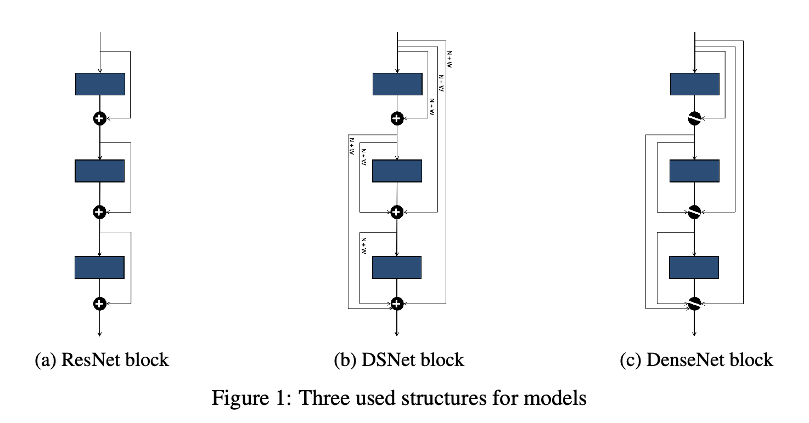
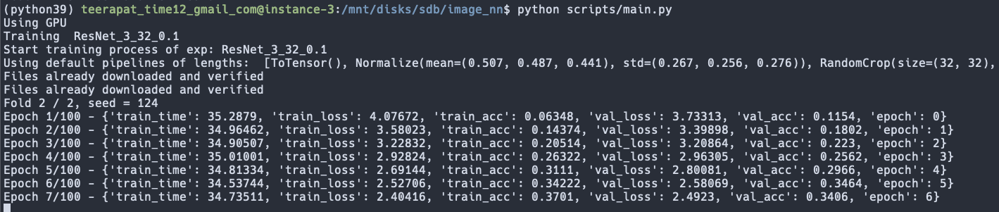
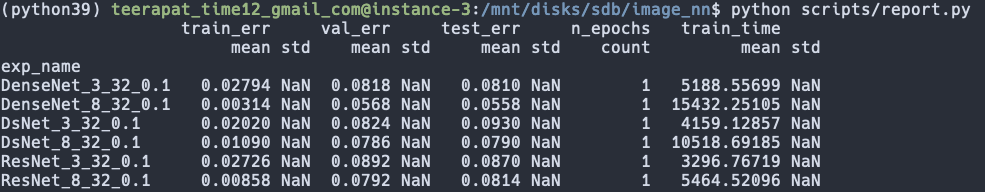

# A Deeper Look into Dense Shortcut Nets

In this project, we further investigate a recent shortcut-connection model that
tries to combine the advantages of ResNet with those of DenseNet. Specifically, it
tries to achieve DenseNet’s high performance, while keeping the memory footprint
as low as ResNet. We will try out alternative shortcut connections, different
backbone structures, extend the ablation studies done in the paper, and experiment
with the model’s performance in a more diverse set of datasets.



---

### Installation
- Make sure you have conda in your local machine, then follow the steps below.

```bash
# From the project root directory, create conda envirnoment from environment.yml
$ conda env create --name python39 --file environment.yml
# Activate the created environment
$ conda activate python39
# Set current project path as executable so that conda environment uses the project code.
$ pip install -e .
# All tests should passed if the environment installation is complete.
$ pytest 
```

---

### Usage 

After successfully setting up python environment, use this command to start the training.

```bash
$ python scripts/main.py
```



Use this command to see the summary of losses and accuracies of all the models. The training process logs the training once each model finishes the training, so all the finished training models will be shown here.

```bash
$ python scripts/report.py
```



---
  
### Experimentation (high-level)

All the training configuration is in [scripts/main.py](./scripts/main.py) file. 
You can edit the set of configurations you want to train your model on there.

Each configuration specifies the dataset and the cleaning process, model and its hyperparameters, and other training process related hyperparameters. Mainly, you want to specify a list of configurations and compare their results. For instance, experimenting on ResNet vs. DenseNet vs. DsNet consists can be thought of three configurations.

The runner runs the configuration list defined in `main.py` and report the training, validation, and testing set errors and losses between the experiments. For each configuration, the code log the result as a folder in this format  `"$PROJECT/_results/{RUN_NAME}/{CONFIGURATION_NAME}/{KFOLD}"`   

**Specifiable configurations**  
    - Dataset (CIFAR10? CIFAR100, [other built-in datasets](https://pytorch.org/vision/stable/datasets.html#built-in-datasets))  
    - Data transform policy (padding, horizontal flip?)  
    - Model (ResNet, DenseNet, DSNet, or write your own + model sizes)  
    - Other hyperparameters (n_epochs, optimizer, learning rate, gamma)  
    
**What the code provides**  
    1. Training/Validation metrices (losses, acc, time in seconds) for each epoch  
    2. Training/Validation/Test metrices at the end of training  
**Result visualization**  
    - Follow this notebook on how to visualize the training result [[Link](https://github.com/teerapat-ch/image_nn/blob/master/notebooks/Report%20Visualization%20-%20ResNet%20vs%20DsNet%20vs%20DenseNet.ipynb)]

---

### Code High-Level

```mermaid
classDiagram
  direction RL
  
  class Runner {
    -data
    -model
    -logger
    -run()
  }
  
  class Logger {
    on_epoch_end(training_info: dict)
    on_training_end(training_info: dict)
  }
  
  class TrainingConfig {
    ## Model specific ##
    get_model: Callable[..., ModelABC] = None # E.g., ResNet
    model_params: Dict[str, Any] = None
    ## Data loader specific ##
    dataset_builder: Callable = D.CIFAR10
    pipelines: List
    test_pipelines: List
    name: str = "default"
    batch_size: int = 128
    valid_ratio: float = 0.1  # train + valid = 1.0
    small: bool = False
    ## Training specific ##
    n_epochs: int = 180
    optimizer: Callable = optim.SGD  # or "adam"
    # Optimizer
    lr: float = 0.1
    momentum: float = 0.9
    weight_decay: float = 0.0001
    ## Scheduler ##
    milestones: List[int]
    gamma: float = 0.1
    n_early_stopping: int = 5  # Set to -1 is don't want to early stopping
    k_fold: int = 1
    kth_fold: int = -1
    is_cuda: bool = False
  }
  
  class DataLoader{
    -data_config: DataConfig
    __next__()
  }
  
  class TrainingLogs_npy_file{
    Losses and average for each epoch
    Can visualize later using seaborn
  }
  
 class Summarized_npy_file {
   Loss and average on test set 
   computed at the end of training
  }
  
  class TrainingConfigsStr_npy_file {
    The TrainingConfig used for
    this training iteration
  }
  
  class Model{
    model_n: int
    num_classes: int
    forward()
  }
  
  class ResNet
  class DenseNet
  class DsNet
  
  TrainingConfig --> Runner
  
  ResNet --|> Model
  DenseNet --|> Model
  DsNet --|> Model
  Runner --> DataLoader
  Runner --> Model
  Runner --> Logger
  
  Logger --> TrainingLogs_npy_file
  Logger --> Summarized_npy_file
  Logger --> TrainingConfigsStr_npy_file
  
  ```
  
---

### Installation Notes on Google Cloud Platform (GCP)

This project is trained on GCP. Here are links that might help you along the environment setup process.

- Installation Script: [[Link](https://github.com/teerapat-ch/image_nn/blob/master/gce_install_script.sh)]
- Installing Nvidia drivers on GCP: [[Link](https://cloud.google.com/compute/docs/gpus/install-drivers-gpu)]  
- Jupyter on GCP: [[Link](https://towardsdatascience.com/running-jupyter-notebook-in-google-cloud-platform-in-15-min-61e16da34d52)]  
- Adding conda env to Jupyter: [[Link](https://medium.com/@nrk25693/how-to-add-your-conda-environment-to-your-jupyter-notebook-in-just-4-steps-abeab8b8d084)]  
